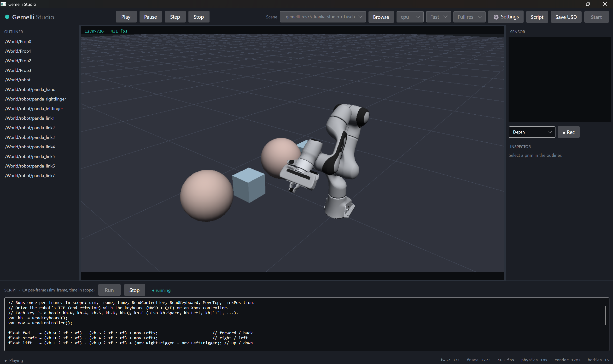

# Gemelli Studio

*Gemelli* — Italian for "twins" (as in *digital twin*).

A **C#/.NET digital-twin runtime and editor**. Load an Isaac Sim–exported USD scene and run rigid-body +
articulation physics alongside physically-accurate sensor rendering, entirely in managed code — no live
Isaac Sim in the loop. Everything is .NET 8/10, C#, x64.



*The Studio UI: a Franka Panda driven live by the per-frame C# script (bottom), rendered in the fast
rasterized viewport at 431 fps, with the prim outliner (left), the depth-sensor panel (right), and the
status bar showing physics 1 ms / render 17 ms.*

It is built on two native engines, each wrapped in a thin C# binding:

- [`Nvidia.OvPhysx`](https://github.com/CristianMori/PhysX) — physics (PhysX articulations via *ovphysx*)
- [`Nvidia.Ovrtx`](https://github.com/CristianMori/ovrtx) — RTX path-traced rendering + sensors (*ovrtx*)

The single hand-off artifact between an authoring tool (Isaac Sim) and Gemelli is **USD** — exactly what
Isaac Sim exports. Gemelli treats that USD as an editable, save-back-able document, not an opaque blob.

> **Platform: Windows x64 only (for now).** The native RTX/Omniverse engine binaries ship as Windows
> libraries, and a few input/crash/lib-resolution touchpoints use Win32 APIs. The architecture itself is
> portable — the .NET orchestrator, Avalonia UI, GL rasterizer, IPC, and scripting are all cross-platform —
> so a **Linux build is a possible future direction**, pending Linux engine binaries and abstracting those
> Windows-specific bits.

---

## Highlights

- **Two interchangeable viewports.** A custom **GL rasterizer** for a fast (~hundreds of fps) interactive
  view, and the **ovrtx** path tracer for ground-truth RTX rendering and the sensor cameras.
- **Real robot control.** Drive articulations by joint-drive targets, Cartesian end-effector targets
  (differential IK), a per-frame C# script, or live keyboard / Xbox-controller teleop.
- **Sensors & synthetic data.** Color, depth, and instance segmentation as typed frames; record a labeled
  dataset to disk (color + raw/preview depth + segmentation + manifest).
- **Live editing + USD save-back.** Edit transforms in the inspector; bake the current body poses *and*
  robot joint state back to a standalone `.usda`.
- **Adjustable time.** A settings pane exposes the physics timestep and a sim-time **time-scale** (slow-mo
  through ~10× acceleration, bounded by physics throughput).
- **One assembled-app folder.** A `dotnet build` drops the whole app into `dist\<Config>\`.

---

## Quick start

With the native libraries placed under `native\` (see [Setup](#setup)), no environment setup is needed —
the apps auto-discover them. From the repo root (PowerShell):

```powershell
.\run-studio.ps1            # build if needed, then launch the Studio UI

.\run-headless.ps1 --usd scenes\franka_studio.usda `
    --products /Render/OmniverseKit/HydraTextures/camera_sensor_162912244368 `
    --steps 60 --device gpu --record out\dataset
```

In Studio: pick a scene from the dropdown (or **Browse**), choose a device, press **Start**. Drag to
orbit · Shift-drag to pan · wheel to zoom. Select a body in the outliner to edit its transform in the
inspector; switch the **Sensor** panel between Color / Depth / Segmentation; **⚙ Settings** opens the
pacing pane; **● Rec** records a dataset; **Save USD** bakes the current state (including robot joint pose)
to a new `.usda`.

---

## Architecture: two processes, one document

**ovphysx and ovrtx cannot share a process.** Both bundle their own (incompatible) versions of the
Omniverse/Carbonite plugin stack, and Carbonite allows exactly one plugin registry per process, so
co-loading them crashes. Gemelli therefore runs each engine in its own worker process and bridges them
over named pipes, with a wrapper-free orchestrator (`Gemelli.Core`) in the middle:

```
                         Gemelli.Core  (orchestrator, no native engine)
                              TwinSession
        ┌───────────────────────┴────────────────────────┐
   named pipe                                         named pipe
        │                                                │
 Gemelli.PhysicsHost   ── rigid-body poses (N×7) ──►  Gemelli.RenderHost
   (ovphysx)              orchestrator converts          (ovrtx)
   step + read poses      to USD 4×4 matrices            WriteAttribute(omni:xform) → Step → frames
```

Each frame: physics steps and returns rigid-body + articulation-link poses → the orchestrator converts
them to USD matrices → the render worker writes `omni:xform` and renders the configured products → typed
sensor frames come back. Poses cross the pipe; rendered images stay in the render process (transported via
shared memory). The USD document is the single source of truth that both workers load.

### The fast viewport

The interactive navigation viewport doesn't need physically-accurate light transport — only the *sensor*
cameras do. So the main viewport is drawn by a small in-process **GL rasterizer** (`Gemelli.Viewport`):
it reads the scene geometry once with USD.NET (meshes, USD shapes, instanced robot links, per-face
material colors from `GeomSubset` bindings), bakes each mesh into its controlling rigid body's frame, and
each frame draws the latest poses with smooth (Gouraud) shading over a ground grid — offscreen, then reads
the pixels back into the viewport. It runs on its own thread reading the latest pose cache, so it stays
smooth independent of the sim/sensor rate. **RTX** mode swaps the viewport back to the ovrtx path tracer.

### One assembled-app folder

A `dotnet build -c Release` assembles the whole app under `dist\Release\`:

```
dist\Release\
  Gemelli.Studio.exe          orchestrator + UI (carries the USD.NET / Silk.NET native libs)
  Gemelli.Headless.exe        orchestrator, no UI
  Gemelli.Mcp.exe             orchestrator, MCP server
  physics\Gemelli.PhysicsHost.exe    ovphysx worker (isolated subfolder)
  render\Gemelli.RenderHost.exe      ovrtx worker (isolated subfolder)
```

The workers live in their own subfolders on purpose: the Studio process carries USD.NET's native USD/TBB
libraries (for the rasterizer), and ovrtx ships its *own* Omniverse USD + a different TBB. If they shared
one directory those libraries would shadow ovrtx's runtime and crash its loader — so each worker gets a
clean directory, and the orchestrator finds it by a fixed relative path (no scanning).

---

## Project layout

| Project | Role |
|---|---|
| `src/Gemelli.Core` | Orchestrator (no native engine): named-pipe IPC, `TwinSession`/`TwinService`, transform conversion, sensor frames, control layer (`ISimApi`, IK), PNG encoder |
| `src/Gemelli.Viewport` | Fast GL rasterizer: USD geometry load, offscreen render, pose-driven viewport |
| `src/Gemelli.Physics` → `physics\Gemelli.PhysicsHost.exe` | ovphysx worker |
| `src/Gemelli.Render` → `render\Gemelli.RenderHost.exe` | ovrtx worker (`SensorHub` maps outputs to typed frames) |
| `src/Gemelli.Studio` → `Gemelli.Studio.exe` | Avalonia UI: viewport, outliner, inspector, sensor panel, script panel, settings |
| `src/Gemelli.Headless` → `Gemelli.Headless.exe` | Console host: load USD → run loop → save PNGs / record datasets |
| `src/Gemelli.Scripting` | Roslyn `.csx` controller host (hot-reload) + script globals |
| `src/Gemelli.Mcp` → `Gemelli.Mcp.exe` | Model Context Protocol server (stdio) — tool-drivable, incl. `render_frame` vision |
| `scenes/` | Sample Isaac Sim–exported USD scenes (franka_studio, isaac_quickstart, …) |
| `tools/` | USD authoring (`usd-addcam`, `usd-addseg`, `usd-snapshot`) and de-risk probes (`raster-probe`, `ovrtx-smoke`, `artic-probe`) |
| `tests/Gemelli.Tests` | xUnit; tier-1 (pure) + gated tier-2 live-twin tests |
| `external/` | **Vendored** wrapper sources (gitignored — re-create below) |
| `native/` | **Vendored** native libraries (gitignored — acquire below) |
| `run-studio.ps1` / `run-headless.ps1` | One-command launchers (build if needed, auto-discover native libs) |

---

## Setup

Re-create the vendored wrapper sources (shallow sparse clones):

```bash
mkdir -p external && cd external
git clone --depth 1 --filter=blob:none --sparse https://github.com/CristianMori/ovrtx.git ovrtx
( cd ovrtx && git sparse-checkout set csharp include skills examples )
git clone --depth 1 --filter=blob:none --sparse https://github.com/CristianMori/PhysX.git physx
( cd physx && git sparse-checkout set ovphysx/csharp )
```

Native libraries (gitignored, version-matched). The apps auto-discover these conventional paths, so no
environment variables are required when they're in place:

- **ovphysx** from the PyPI wheel:
  `pip download ovphysx==0.4.13 --no-deps --only-binary=:all: -d native/ovphysx_wheel`, extract →
  `native/ovphysx/ovphysx/lib/ovphysx.dll`. (Override with `OVPHYSX_LIB`.)
- **ovrtx** from the ovrtx GitHub release `v0.2.0` (windows-x86_64 zip) → `native/ovrtx/bin/`.
  (Override with `GEMELLI_OVRTX_DIR`.)

Build & test (no native libraries required for the tier-1 tests):

```bash
dotnet build Gemelli.slnx -c Release
dotnet test tests/Gemelli.Tests --filter TransformConversion
```

---

## Studio UI

`Gemelli.Studio` is a code-only Avalonia app (no XAML) over the shared `TwinService`. Launch with
`.\run-studio.ps1`. Layout:

- **Header** — brand · transport (Play / Pause / Step / Stop) · scene dropdown + Browse · device ·
  viewport mode (**Fast** / **RTX**) · render scale · **⚙ Settings** · Script toggle · **Save USD** · Start.
- **Outliner** (left) — rigid-body tree; select a body to inspect/edit it.
- **Viewport** (centre) — live render; drag = orbit, Shift-drag = pan, wheel = zoom.
- **Sensor** panel (right top) — fixed sensor camera with Color / Depth / Segmentation toggle + **● Rec**.
- **Inspector** (right) — editable transform (X/Y/Z + Apply, written live) and a live pose readout.
- **Script** panel (toggle) — per-frame C# (`.csx`) compiled by Roslyn; keyboard + Xbox controller
  readable in-script.

### Settings — timestep & time-scale

The **⚙ Settings** pane exposes the two pacing knobs, applied live to a running twin (and seeded into the
next run):

- **Time scale** — sim-time : wall-clock factor. `1×` is real speed; `10×` runs ten seconds of simulation
  per real second; `<1×` is slow-mo. The achievable speed-up is bounded by physics throughput: sim time
  advanced per wall-second ≈ `timestep ÷ physics-ms-per-step`. The pane shows the measured physics step
  time and the resulting ceiling, and tells you when a request exceeds it (it then runs flat-out).
- **Physics step** — the fixed timestep. Smaller is more accurate/stable; larger is cheaper but can
  destabilize articulations.

### Driving the robot

The default script (Script panel) is keyboard / gamepad teleop of the Franka's end-effector:

```csharp
// .csx body runs each frame with sim, frame, time, ReadKeyboard, ReadController, MoveTcp, LinkPosition in scope.
var kb  = ReadKeyboard();
var mov = ReadController();
float fwd    = (kb.W ? 1f : 0f) - (kb.S ? 1f : 0f) + mov.LeftY;
float strafe = (kb.D ? 1f : 0f) - (kb.A ? 1f : 0f) + mov.LeftX;
float lift   = (kb.E ? 1f : 0f) - (kb.Q ? 1f : 0f) + (mov.RightTrigger - mov.LeftTrigger);

var tcp = LinkPosition("/World/robot", 8);
if (tcp.HasValue)
    MoveTcp("/World/robot", 8, tcp.Value.X + fwd*0.02f, tcp.Value.Y + strafe*0.02f, tcp.Value.Z + lift*0.02f);
```

`MoveTcp` runs one damped-least-squares differential-IK step toward a world-space target and commands the
joint drives. It integrates onto the last *commanded* target (not the gravity-drooped measurement), so the
arm holds position when you release the keys instead of sagging.

---

## Sensors & recording

Each render product exposes its render vars as typed frames. **Depth** (`DistanceToImagePlaneSD`, float32
distance, background = +inf) and **color** (`LdrColor`) work out of the box on products that carry them
(e.g. franka_studio's `camera_sensor`). **Segmentation** (`InstanceSegmentationSD`) needs the AOV authored
— run `usd-addseg` to produce a `*_seg.usda`. In Studio the **Sensor** panel toggles Color / Depth /
Segmentation; headless `--record <dir>` writes a synthetic-data set: `color_NNNNN.png`, raw
`depth_NNNNN.f32` + preview `depth_NNNNN.png`, `seg_NNNNN.*` when present, and a `manifest.jsonl`.

The render product needs a camera that exists in the USD. The `tools/` USD-authoring helpers:

- `usd-addcam` — add a perspective camera + dome light if the scene lacks them.
- `usd-addseg` — add an `InstanceSegmentationSD` AOV + semantic labels so segmentation renders.
- `usd-snapshot` — bake current body poses **and robot joint state** (radians → USD degrees) into a
  standalone `.usda`, so a posed scene reloads exactly as left.

---

## Headless

```powershell
.\run-headless.ps1 --usd scenes\franka_studio.usda `
  --products /Render/OmniverseKit/HydraTextures/camera_sensor_162912244368 `
  --steps 120 --out out --device gpu --record out\dataset
```

Flags: `--usd --products --steps --out --record <dir> --dt --rigid <glob> --device cpu|gpu|auto
--script <path.csx> --dump-dof <robotPath>` (`--ovrtx-lib` / `--ovphysx-lib` optional, auto-discovered).
The first render compiles RTX shaders (slow once, then cached). Color PNGs (plus normalized depth PNGs
when the product carries depth) land in `out\`; `--record` writes the labeled dataset described above.

---

## Control layer

Controllers drive the twin through one interface, `ISimApi` (read sensors + physics tensor channels, write
DOF position/velocity targets and poses), via a `TwinRunner` that calls each `IController.OnPreStep` before
stepping:

- `PlaybackController` — passive (physics and any USD time-keyed animation play out on their own).
- `ScriptController` (`Gemelli.Scripting`) — runs a user **C# `.csx`** once per frame, compiled by Roslyn
  and **hot-reloaded** on save; a bad script reports once and never crashes the twin.
- `IkDragController` — drives an articulation link toward a continuously-updated world target via
  differential IK.

```csharp
// Read live state and command actuation through ISimApi (over IPC):
float[] poses = sim.Read(RigidBodyPose, "/World/Cube*");
sim.SetDofPositionTargets("/World/arm", new[]{ 0f, -0.4f, 0f });
```

How a robot moves, end to end: an articulation's joints each carry a PhysX PD drive. You write a
**drive target** (`set_dof_position_targets` ≡ `ISimApi.SetDofPositionTargets`); the solver applies torques
every step to move the joints toward it, respecting mass, inertia, and limits. Position targets say "go to
this pose," velocity targets say "spin at this rate."

---

## Tool-drivable (MCP server)

`Gemelli.Mcp` exposes the twin over the **Model Context Protocol** (stdio) so any MCP-compatible client can
drive it via tools: `start_twin`, `step`, `get_info`, `list_rigid_bodies`, `read_poses`, `read_dof`,
`set_dof_targets`, `stop_twin`, and **`render_frame`** — which returns the camera image as MCP image
content. It drives the shared `TwinService` (one twin per server, calls serialized onto the sim thread).

Point the client at the built exe; native libraries are auto-discovered under `native\` (add an `env`
block only if they live elsewhere):

```json
{
  "mcpServers": {
    "gemelli": {
      "command": "C:\\DataDrive\\ovGemelli\\dist\\Release\\Gemelli.Mcp.exe"
    }
  }
}
```

Note: MCP handles tool calls concurrently — call `start_twin` and wait for its reply before stepping (it
blocks during worker launch + warmup); a normal sequential client does this naturally.

---

## Performance notes

Measured on the development machine (falling-boxes scene):

| Lever | Effect |
|---|---|
| Fast (rasterized) viewport vs RTX | the rasterizer runs at hundreds of fps; RTX is dominated by the path-tracing floor below |
| RTX render mode: RealTimePathTracing vs PathTracing | ~22 ms vs ~27 ms @720p (minor for simple scenes) |
| RTX resolution: 720p → 540p → 360p | 22 → 15 → 14 ms (diminishing returns; ~13 ms floor) |
| Shared-memory frame transport vs pipe | −~4 ms @720p (scales with resolution / sensor count) |

There is a **~13 ms per-frame RTX floor** (denoise + light transport) independent of geometry, resolution,
or transport — inherent to path tracing. That floor is why the navigation viewport is rasterized: physics
and the bridge run at hundreds of fps, so a cheap rasterized view keeps the UI fluid while ovrtx is
reserved for the sensor cameras and ground-truth RTX mode.

---

## Status

- ✅ Two-process twin verified end-to-end (physics simulates + renders, motion across frames; CPU **and** GPU physics)
- ✅ ovphysx (PyPI 0.4.13) and ovrtx (0.2.0) installed and verified live on an RTX GPU
- ✅ Real Isaac Sim import verified — a genuine export loads into both engines and renders, with no live Isaac Sim
- ✅ Bridged articulation link poses — robots render in motion
- ✅ **Fast rasterized viewport** (`Gemelli.Viewport`): USD geometry incl. instanced robot links, per-face materials, smooth shading, pose-driven, hundreds of fps
- ✅ **Sensors**: depth + segmentation; Studio Sensor panel (Color / Depth / Seg)
- ✅ **Recording / synthetic data-gen**: color + raw/preview depth + segmentation + `manifest.jsonl`
- ✅ **Live editing + USD save-back**: inspector transform edit; `usd-snapshot` bakes body poses **and robot joint state**
- ✅ **Control**: `ISimApi` + playback / Roslyn C# scripting / differential IK; keyboard + Xbox-controller teleop
- ✅ **Adjustable pacing**: live time-scale (slow-mo → ~10×) and physics timestep via the Settings pane
- ✅ **MCP server** (`Gemelli.Mcp`) — tool-drivable incl. `render_frame` vision; verified end-to-end
- ✅ **Avalonia Studio** — viewport + transport + outliner + inspector + sensor panel + settings over the shared `TwinService`
- ✅ Packaging: single assembled-app folder (`dist\<Config>\`), native-lib auto-discovery, one-command launchers
- ✅ Hardening: worker-crash surfacing, run-loop fault tolerance, clean shutdown, quiet console
- ✅ Tier-1 tests (transform + control/scripting + `TwinService` threading); named-pipe IPC; PNG encoder

---

## License

Apache License 2.0 © 2026 Cristian Mori. See [LICENSE](LICENSE).

The two native engines (*ovphysx*, *ovrtx*) and their C# wrappers are acquired separately under their own
terms; they are not redistributed here (see [Setup](#setup)).
